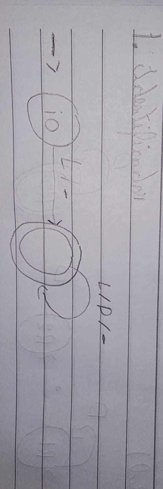
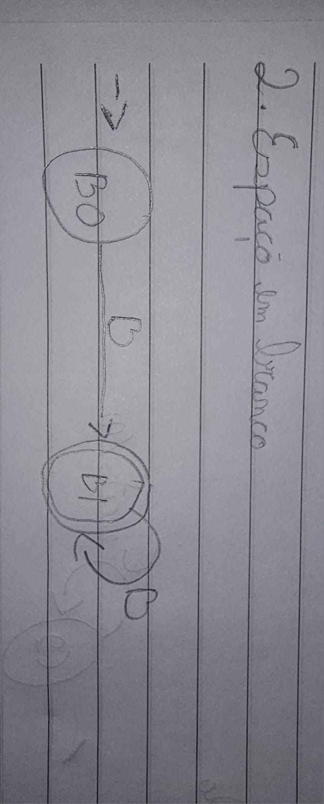
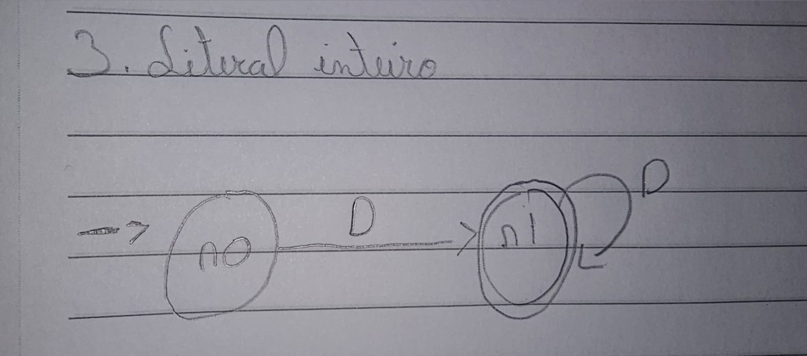
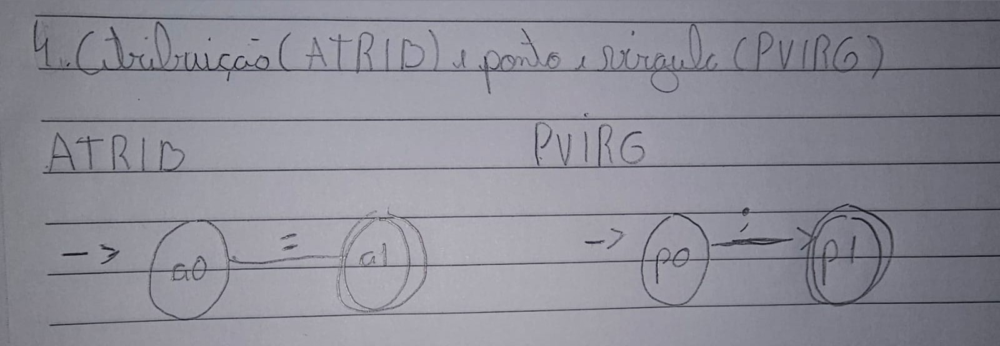
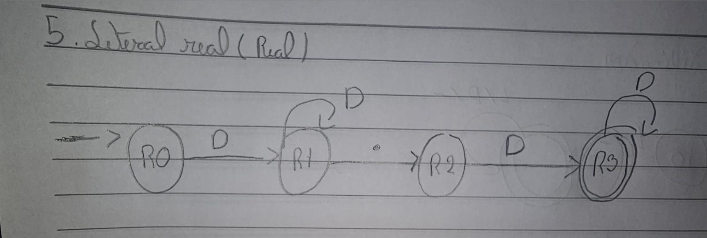
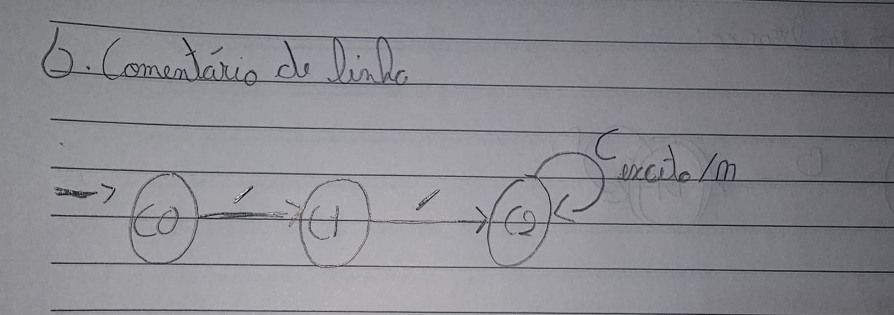

# Relatório — Atividade 1: Analisador Léxico de Declarações de Variáveis

Todos os 8 níveis do `testar.py` passam. Este relatório documenta os autômatos
escritos em `afds.py` (níveis 1, 2, 4 e 6 — os níveis 3 e 5 não exigem autômato
novo, só entradas no dicionário `PALAVRAS`).

## 1. Identificador (`ID`) — já vinha pronto (nível 0)

| Estado | O que ele lembra |
|---|---|
| `i0` | Ainda não li nenhum caractere. |
| `i1` (final) | Já li o primeiro caractere válido (letra ou `_`); daqui em diante aceito qualquer sequência de letras, dígitos ou `_`. |

**2 estados**: a única regra especial é o primeiro caractere (não pode ser dígito); depois disso o comportamento não muda mais, então um estado de loop resolve o resto.

## 2. Espaço em branco (`BRANCO`) — já vinha pronto (nível 0)

| Estado | O que ele lembra |
|---|---|
| `b0` | Ainda não li nenhum espaço. |
| `b1` (final) | Já li um ou mais espaços/tabs/quebras de linha seguidos. |

**2 estados**, mesma estrutura do `ID`: primeiro caractere obrigatório, resto em loop livre no mesmo conjunto de símbolos.

## 3. Literal inteiro (`INTEIRO`) — nível 1

| Estado | O que ele lembra |
|---|---|
| `n0` | Ainda não li nenhum dígito. |
| `n1` (final) | Já li um ou mais dígitos seguidos. |

**2 estados**: estrutura idêntica ao `BRANCO`, só troca `BRANCOS` por `DIGITOS`.

## 4. Atribuição (`ATRIB`) e ponto e vírgula (`PVIRG`) — nível 2

| Estado | O que ele lembra |
|---|---|
| `a0` | Ainda não li o `=`. |
| `a1` (final) | Acabei de ler o `=`. **Sem transição de volta**: se o próximo caractere também for `=`, o autômato rejeita e o restante vira um novo token — é assim que `"=="` sai como dois `ATRIB` em vez de um só. |
| `p0` | Ainda não li o `;`. |
| `p1` (final) | Acabei de ler o `;`, mesma lógica de não voltar ao estado inicial. |

**2 estados cada**: token de tamanho fixo (1 caractere), não existe "continuar lendo".

## 5. Literal real (`REAL`) — nível 4

| Estado | O que ele lembra |
|---|---|
| `r0` | Ainda não li nenhum dígito. |
| `r1` (**não final**) | Já li a parte inteira (um ou mais dígitos), mas ainda não vi o ponto. |
| `r2` (**não final**) | Acabei de ler o ponto; ainda não sei se vem dígito depois. |
| `r3` (final) | Já li pelo menos um dígito depois do ponto — agora sim é um real válido. |

**4 estados** — a armadilha do enunciado é exatamente aqui: `r1` e `r2` **não podem ser finais**.
- Se `r1` fosse final, `"42"` (só parte inteira) empataria em tamanho com `afd_inteiro` e, como `REAL` vem antes de `INTEIRO` na lista `REGRAS`, o desempate faria `"42"` virar `REAL` por engano.
- Se `r2` fosse final, `"12."` seria aceito como número válido, o que o enunciado proíbe explicitamente.

## 6. Comentário de linha (`COMENTARIO`) — nível 6

| Estado | O que ele lembra |
|---|---|
| `c0` | Ainda não li nenhuma barra. |
| `c1` (**não final**) | Li uma barra; se o próximo caractere não for outra barra, o autômato rejeita — por isso `"/"` sozinho dá erro léxico (divisão fica para a Atividade 2). |
| `c2` (final) | Já li `//`; aceito qualquer caractere que não seja quebra de linha, indefinidamente (`SIGMA - {'\n'}`), porque o comentário termina no fim da linha, não incluindo o `\n`. |

**3 estados**: dois para confirmar as duas barras, um para o loop até a quebra de linha.

## 8. Resumo de estados por autômato

| Token | Nº de estados | Observação |
|---|---|---|
| `ID` | 2 | 1º caractere restrito, resto livre |
| `BRANCO` | 2 | Um ou mais espaços |
| `INTEIRO` | 2 | Um ou mais dígitos |
| `ATRIB` | 2 | Token de tamanho fixo, sem self-loop no final |
| `PVIRG` | 2 | Token de tamanho fixo, sem self-loop no final |
| `REAL` | 4 | Estados pós-dígito-inicial e pós-ponto não são finais |
| `COMENTARIO` | 3 | Dois estados de confirmação + um loop até `\n` |
